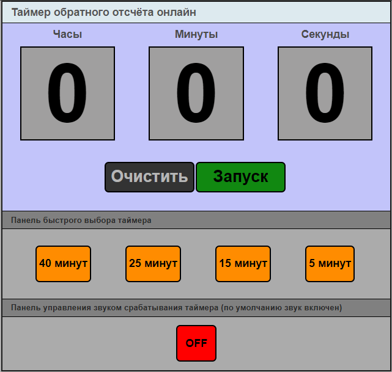

# Проект Onlinetimer

## Оглавление
[1. Описание проекта](README.md#Описание-проекта)  
[2. Что интересного?](README.md#Что-интересного)  
[3. Запуск проекта](README.md#Запуск-проекта)  
[4. Внешний вид запущенного приложения](README.md#Внешний-вид-запущенного-приложения)

### Описание проекта
Веб-сайт с онлайн таймером обратного отсчёта.

### Что интересного?
- Возможность задать обратный отсчёт до 99 часов.
- Меню управления реализовано кнопками Запуск, Продолжить, Очистить.
- Панель быстрого выбора таймера позволяет сразу задать нужное время без ввода его в панель времени.
- В таймере реализована звуковая и визуальная сигнализация окончания времени таймера.
- Звуковая сигнализация по умолчанию включена.
- Для выключения звуковой сигнализации нужно нажать кнопку ON на панели управления срабатывания звука таймера.
- Для включения звуковой сигнализации нужно нажать кнопку OFF на панели управления срабатывания звука таймера.

### Запуск проекта

Перейти по ссылке на веб-страницу онлайн таймера https://hrodvar-one.github.io/onlinetimer/

### Внешний вид запущенного приложения

