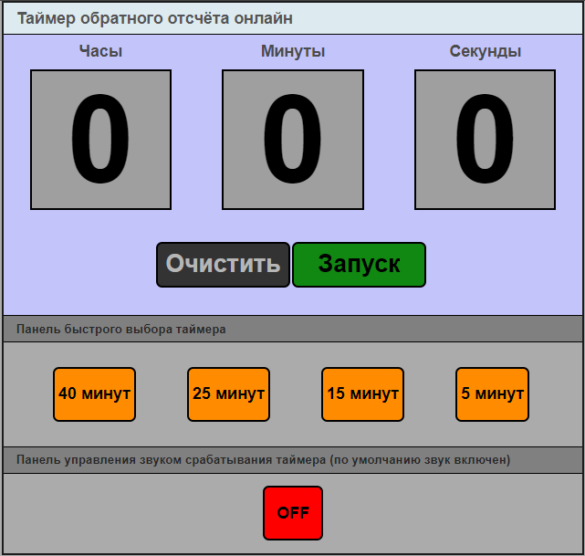

# Проект Onlinetimer

## Оглавление
[1. Описание проекта](README.md#Описание-проекта)  
[2. Что интересного?](README.md#Что-интересного)  
[3. Как пользоваться таймером](README.md#Как-пользоваться-таймером)
[4. Запуск проекта](README.md#Запуск-проекта)
[5. Локальный запуск](README.md#Локальный-запуск)
[6. Проверка работы в фоновой вкладке](README.md#Проверка-работы-в-фоновой-вкладке)
[7. Внешний вид запущенного приложения](README.md#Внешний-вид-запущенного-приложения)

### Описание проекта
Веб-сайт с онлайн таймером обратного отсчёта.


### Что интересного?
- Возможность задать обратный отсчёт до 99 часов.
- Меню управления реализовано кнопками Запуск, Продолжить, Очистить.
- Панель быстрого выбора таймера позволяет сразу задать нужное время без ввода его в панель времени.
- В таймере реализована звуковая и визуальная сигнализация окончания времени таймера.
- Звуковая сигнализация по умолчанию включена.
- Для выключения звуковой сигнализации нужно нажать кнопку ON на панели управления срабатывания звука таймера.
- Для включения звуковой сигнализации нужно нажать кнопку OFF на панели управления срабатывания звука таймера.
- При завершении отсчёта таймер воспроизводит звук, показывает системное уведомление, меняет заголовок вкладки и включает визуальную сигнализацию.
- Отсчёт продолжает правильно рассчитываться, даже когда вкладка таймера находится в фоне.

### Как пользоваться таймером

1. Введите необходимое время в поля **Часы**, **Минуты** и **Секунды** или выберите готовый вариант на панели быстрого выбора.
2. Нажмите кнопку **Запуск**.
3. При первом запуске разрешите браузеру показывать системные уведомления. Благодаря этому сообщение об окончании отсчёта будет видно при работе в другой вкладке.
4. Чтобы временно остановить отсчёт, нажмите **Пауза**.
5. Для продолжения отсчёта нажмите **Продолжить**.
6. Чтобы остановить таймер и обнулить введённое время, нажмите **Очистить**.

Звуковая сигнализация включена по умолчанию:

- значение **ON** означает, что звук включён;
- значение **OFF** означает, что звук выключен;
- переключение выполняется нажатием на кнопку ON/OFF.

После окончания времени:

- воспроизводится звуковой сигнал, если звук включён;
- появляется системное уведомление **«Время вышло!»**, если браузеру выдано разрешение;
- заголовок вкладки меняется на **«⏰ Время вышло!»**;
- фон страницы начинает мигать.

Чтобы остановить сигнализацию и подготовить таймер к следующему запуску, нажмите **Очистить** или выберите время на панели быстрого выбора.

### Запуск проекта

Перейти по ссылке на веб-страницу онлайн таймера https://hrodvar-one.github.io/onlinetimer/

### Локальный запуск

Для корректной работы системных уведомлений рекомендуется открывать проект через локальный HTTP-сервер, а не запускать файл `index.html` напрямую.

Откройте PowerShell в папке проекта и выполните:

```powershell
python -m http.server 8000
```

Если команда `python` недоступна, попробуйте:

```powershell
py -m http.server 8000
```

После запуска сервера откройте в браузере:

```text
http://localhost:8000
```

Для остановки локального сервера нажмите `Ctrl+C` в PowerShell.

### Проверка работы в фоновой вкладке

1. Запустите проект через локальный HTTP-сервер.
2. Установите таймер на 10 секунд.
3. Нажмите **Запуск** и разрешите системные уведомления, если браузер запросит разрешение.
4. Переключитесь на другую вкладку браузера.
5. Дождитесь завершения отсчёта — должны появиться системное уведомление и звуковой сигнал.
6. Вернитесь на вкладку таймера. На экране должно быть значение `0`, фон должен мигать, а заголовок вкладки должен содержать текст **«⏰ Время вышло!»**.

Если уведомление не появилось, проверьте разрешение для сайта в настройках браузера. Звук также может быть отключён настройками сайта, браузера или операционной системы.

### Внешний вид запущенного приложения


